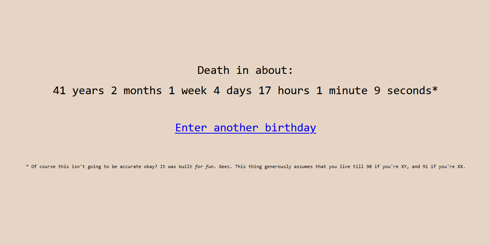

# liveclock

*A death clock in a dead language.*

Oh boy, here comes another learning project. This time, I wanted to learn a
language called LiveScript. It's part of the CoffeeScript family and it really
has some good ideas in it.

### What's good:

I'm going to judge livescript by today's standards which really isn't fair.
This language was way ahead of it's time (2011-2015).

- Classes
- Lambdas
- Cascade operator like Dart's: `..`
- Splats: `...`

### What's not great:

This language has syntax that reminds me of Haskell.

- Significant whitespace (die)
- So many infix operators
- Not easy to break long expressions up onto multiple lines without `\\`
